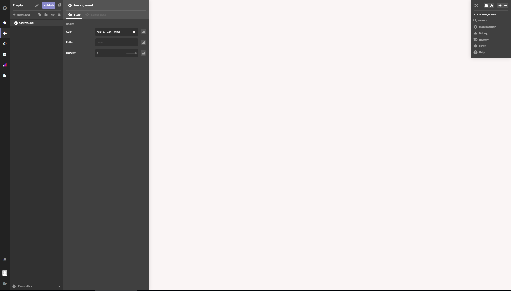
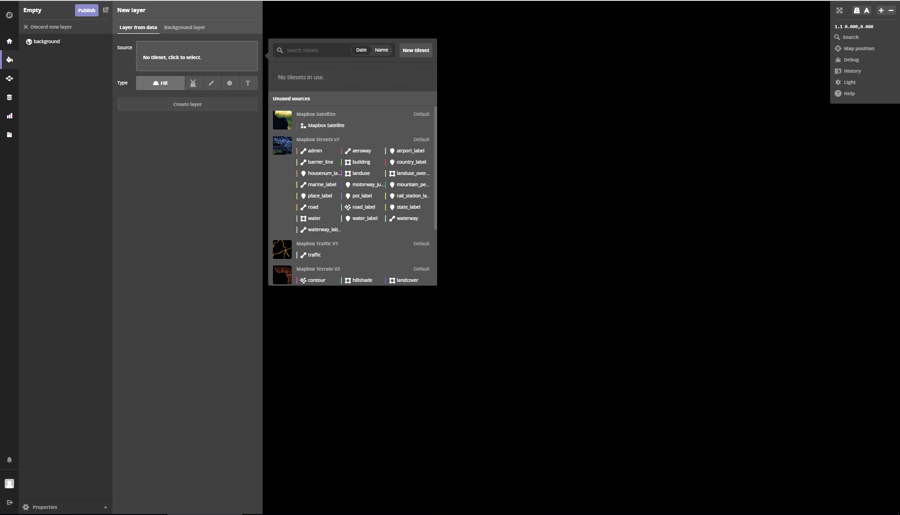
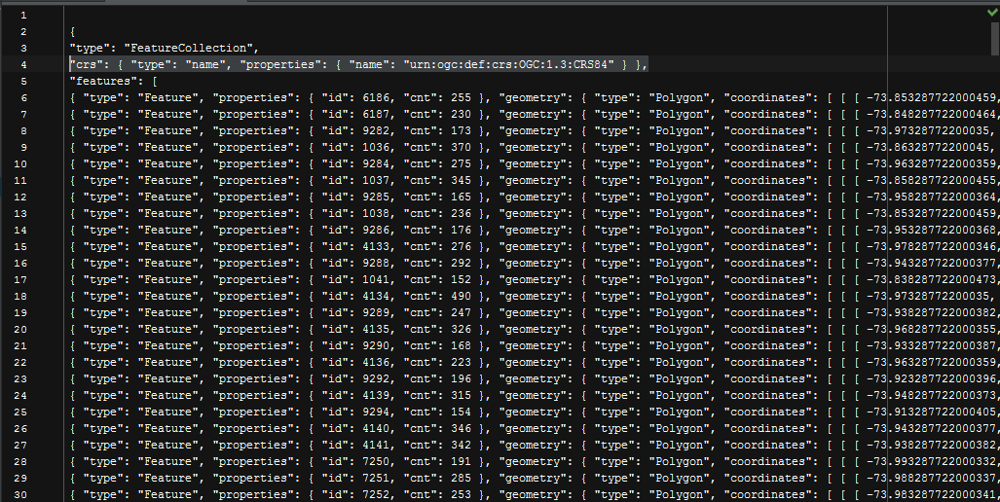
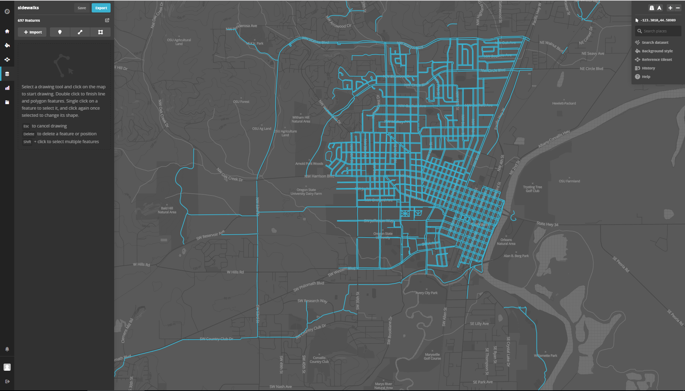
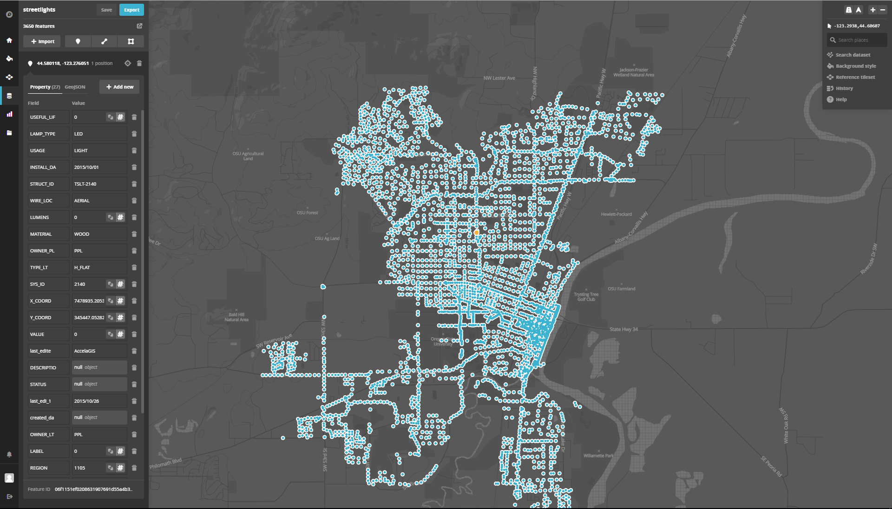
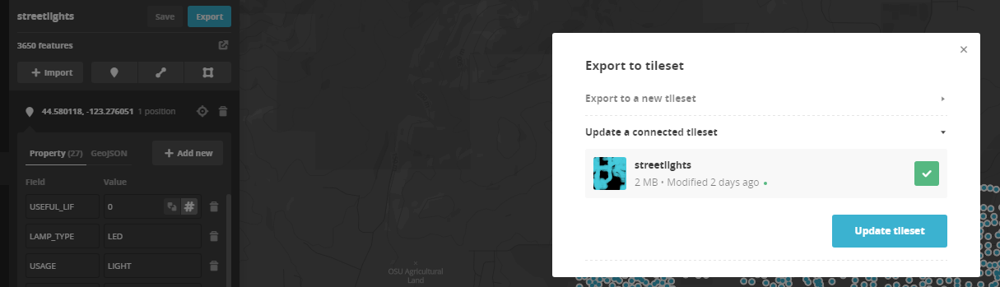
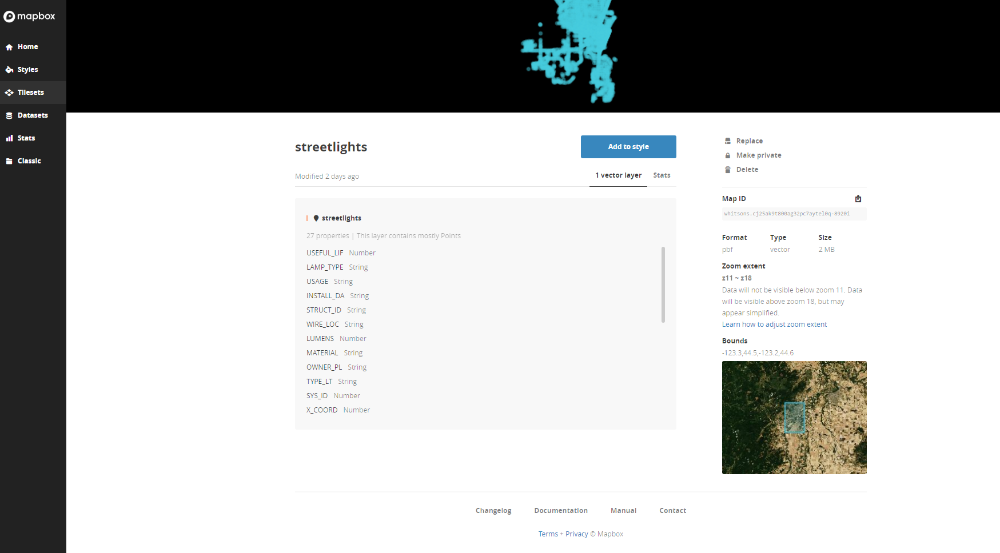
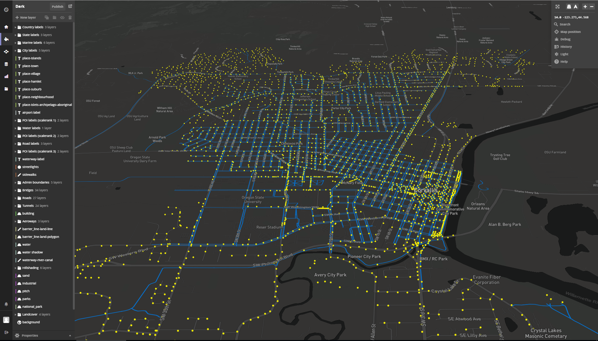
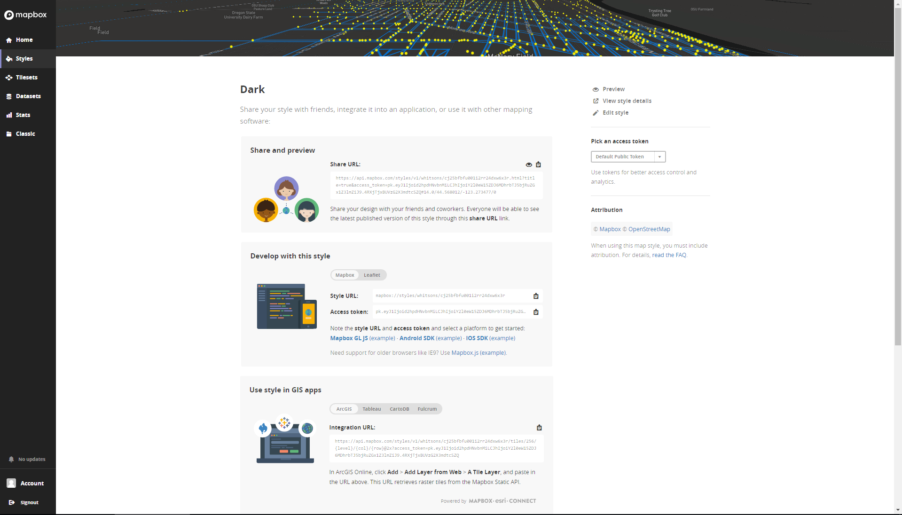
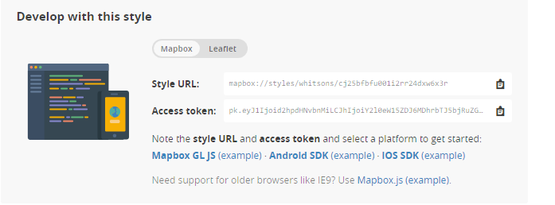

> Spring 2017 | Geography 472/572 | Geovisualization: Geovisual Analytics
>
> Presenter: Scott Whitson
>
> Instructor: Bo Zhao | TA: Kyle R. Hogrefe | Location: LINC 368 | Time: Tuesday/Thursday 9-9:50am

## Create a Style
>Create an Empty Style or Edit an existing style. We will start with an empty style. 

>Add layers from Mapbox Tilesets.
>Add one at a time, select visual scale, and type of feature. 

>Eventually, after your main basemap layers are set, you will have your own basemap that yu can add yor own data to as well.
>Below is an example of custom style with out my own data incorporated.
>Publish your style by selecting publish at the top left. If you publish as new, it is essentially a Save as and creates a ...(copy) style. Always be aware of what style you are editing in case you do publish as new. Once you are comfortable with editing the styles, try editing a default tileset, such as mapbox.dark

## Import your data into a Dataset
>*Important* We must first open the geojson in a text editor (WebStorm) and delete the crs line to successfully import a geojson (under 5mb) into mapbox.

>Datasets are layers in your style not an entire geodatabase. Import one layer for each dataset depending on how you want your symbology or style done.

## Create A Tileset and add it to your style
>After adding each layer, select export at the top left, and export to a new tileset.

>After creating the tileset, you will come to this page where you can add it to one of your editable styles.

>I added the streetlights and sidewalks tilesets that I created to the default dark style, to create a Night Walk map.

## Share, Develop, and Use your custom style
>Select </>share, develop, and use.
>From here, you can add your custom style as a basemap in Arcmap or as a tileset in a web map.

>
>Using Mapbox

>

>Using Leaflet (L.tileset)
	
	

